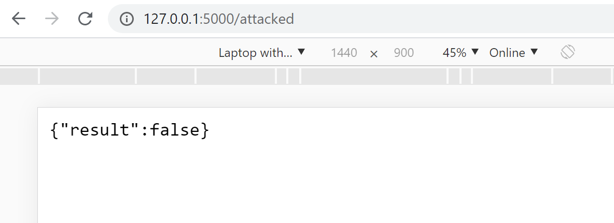

# pyogame_REST

<pre>
This is the pyogame REST API for the library pyogame.
Every function or variable in pyogame is presentet in the url Path. 
Functions that expect parameters are POST JSON request.

You Login over the '/login' url. Same arguments as in pyogame. (see Client.py)
'/' gives you an overview of all functions and variables.
</pre>
 
